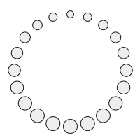

# NimSvg  [](https://travis-ci.org/bluenote10/NimSvg)

Nim-based DSL allowing to generate SVG files and GIF animations.

## DSL

NimSvg's DSL is inspired by [Karax](https://github.com/pragmagic/karax), and allows to generate SVG trees in a similar manner.
A simple hello world would look like this:

```nimrod
import nimsvg

buildSvgFile("examples/basic1.svg"):
  svg(width=200, height=200):
    circle(cx=100, cy=100, r=80, stroke="teal", `stroke-width`=4, fill="#DDD")
```

Which produces the following SVG:

```svg
<?xml version="1.0" encoding="UTF-8" ?>
<svg width="200" height="200">
  <circle cx="100" cy="100" r="80" stroke="teal" stroke-width="4" fill="#DDD"/>
</svg>
```


The DSL allows to mix tag expressions with regular Nim expressions like variable definitions, for loops, or if statements,
which makes it easy to generate SVGs programmatically:

```nimrod
import nimsvg, random, ospaths

buildSvgFile("examples" / sourceBaseName() & ".svg"):
  let size = 200
  svg(width=size, height=size):
    for _ in 0 .. 1000:
      let x = random(size)
      let y = random(size)
      let radius = random(5)
      circle(cx=x, cy=y, r=radius, stroke="#111122", fill="#E0E0F0", `fill-opacity`=0.5)
```


## Gallery

Click on an image to see the corresponding implementation.

[](examples/animation1.nim)

[](examples/animation2.nim)
